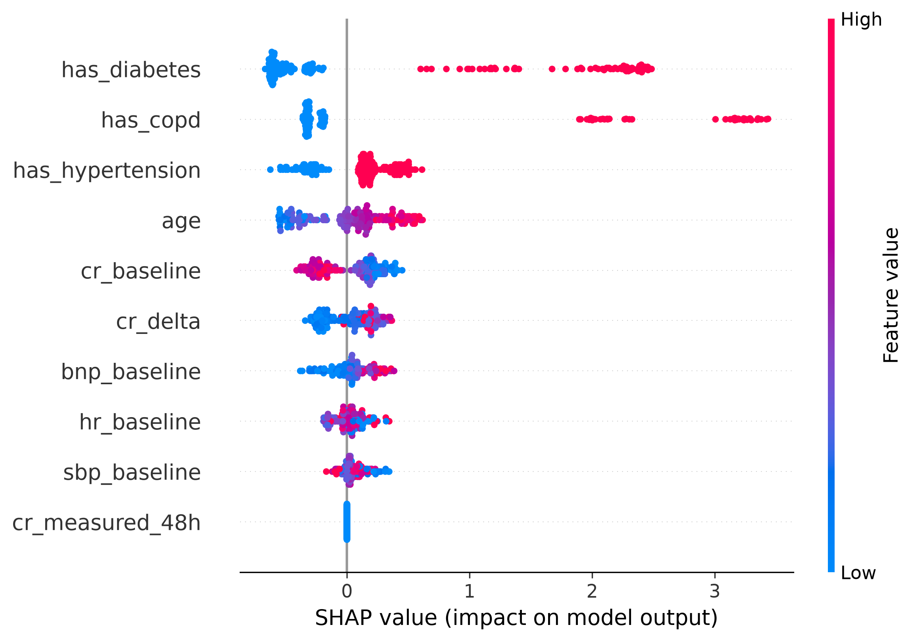
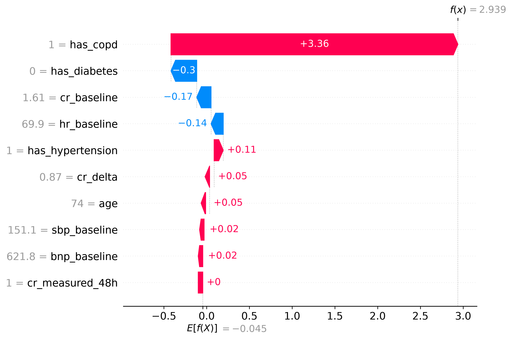
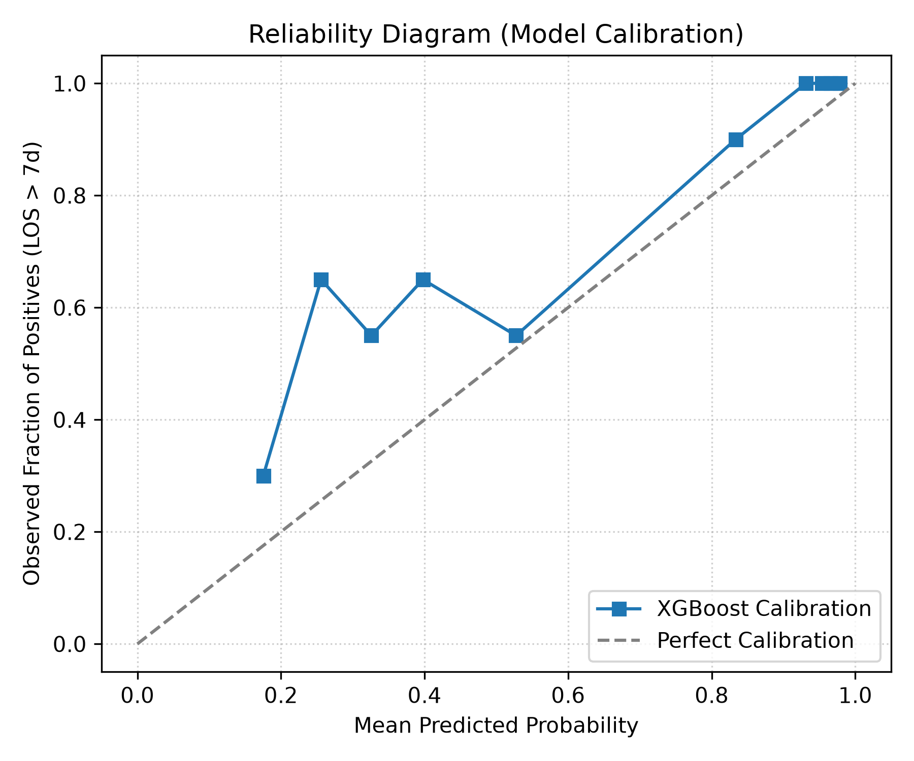
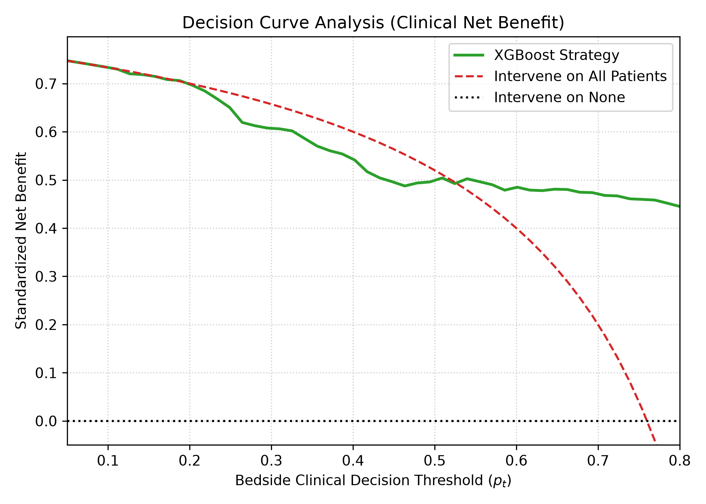

# Inpatient Heart Failure Risk Stratification Pipeline (ICD-10 I50)

An end-to-end clinical machine learning and biostatistical pipeline engineered to predict **Prolonged Length of Stay (> 7 days)** in hospitalized Heart Failure cohorts, integrating baseline electronic health records (EHR) with 48-hour longitudinal biomarker deterioration.

## Clinical Rationale & Formulation
- **Condition**: Congestive Heart Failure (ICD-10: I50).
- **Target Horizon**: Prolonged inpatient admission (> 7 days).
- **Temporal Strategy**: Separate admission baseline triage from dynamic 48-hour re-evaluation to prevent lookahead data leakage.
- **Biomarkers**: Serum Creatinine trajectory ($\Delta$ shift mapping to KDIGO Stage 1 Acute Kidney Injury) and baseline NT-proBNP.
- **Missingness Handling**: Clinical missing indicator encoding to account for Missing Not at Random (MNAR) lab draw behaviors.

## Project Structure
```text
health-data-science/
│
├── clinical_data.db         # Synthetic longitudinal EHR database
├── main.py                  # CLI pipeline orchestrator
├── app.py                   # Streamlit clinical decision support dashboard
├── requirements.txt         # Pinned production dependencies
│
└── src/
    ├── __init__.py
    ├── data.py              # SQL ingestion & cohort extraction
    ├── features.py          # Biomarker trajectory deltas & MNAR encoding
    └── models.py            # Leakage-free scaling, classification & odds ratios## Model Explainability (Bedside Decision Support)

TreeExplainer SHAP values decouple non-linear clinical risk drivers, ensuring gradient-boosted trees remain interpretable:

### Cohort Risk Attribution (Global)


### Bedside Case Attribution (Local Patient 0)

## Clinical Utility & Model Reliability

### Probabilistic Calibration
Evaluates whether predicted probabilities match empirical risk across bins:


### Decision Curve Analysis (DCA)
Quantifies clinical net benefit against default "treat all" or "treat none" policies across decision thresholds ($p_t$):
